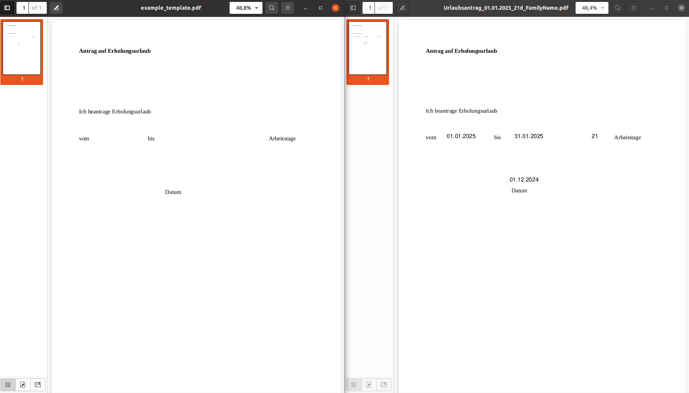
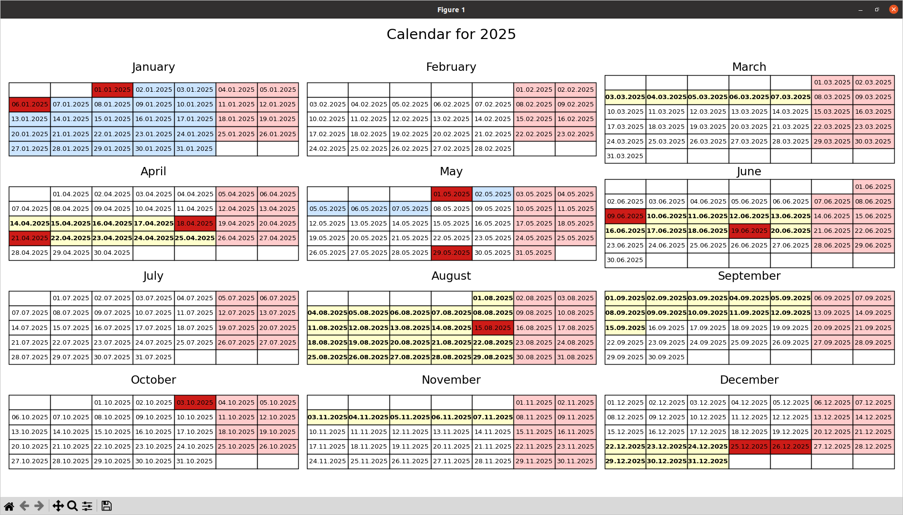

# PDF Vacation Management Tool

This project is a comprehensive solution to manage your personal vacation requests and visualize them alongside public and school holidays. It helps you:

- Generate PDFs for vacation requests.
- Track and save vacation records in CSV format.
- Calculate remaining vacation days based on your annual entitlement.
- Display your vacations, public holidays, and state school vacations on a calendar.

---

## Features

1. **Vacation Request PDF Generation**
   - Create vacation request PDFs using a customizable template.
   - Automatically include details like vacation dates, total days, and signing information.
   - Save the generated PDFs in a year-specific folder.
   - Record vacation details in a CSV file for easy tracking.
2. **Remaining Vacation Calculation**
   - Calculate the remaining vacation days for a given year.
   - Use JSON configuration for vacation entitlement.
   - Account for vacations taken in the current year.
3. **Calendar Visualization**
   - Highlight your vacations, state holidays, and school vacations in a yearly calendar.
   - Use different colors to distinguish between taken vacations, state holidays, and school holidays.

---

## Setup

### Prerequisites
Ensure the following tools and libraries are installed:
- Python 3.8 or higher
- Required Python packages: `argparse`, `json`, `fitz` (PyMuPDF), `csv`, `pandas`, `calendar`, `matplotlib`

Install dependencies using:

```bash
pip install pymupdf pandas matplotlib
```


### Personal Configuration

To tailor the tool to your requirements:

 1.   Update the PDF Template
 	* Replace the `data/template.pdf` with your preferred vacation request template.

 2.  Set Vacation Entitlement
    * Modify `data/vacation_entitlement.json` to match your yearly vacation entitlement.
        
Example:

```json
    {
        "2025": {
            "vacation_from_previous_year": 3,
            "vacation_from_this_year": 30,
            "special_vacation": 2
        }
    }
```

3. Customize `data/config.json`

    * Update the prefix and postfix for generated files:

```json
	"Prefix": "Urlaubsantrag",
	"Postfix": "FamilyName"
```

* Adjust the `text_positions` to align text fields with your PDF template:

```json
        "text_positions": [
            {"x": 100, "y": 245, "type": "from_date"},
            {"x": 240, "y": 245, "type": "to_date"},
            {"x": 400, "y": 245, "type": "days"},
            {"x": 230, "y": 335, "type": "sign_date"}
        ]
```
*     State and School Holidays
        Update `data/state_vacations.csv` and `data/school_vacations.csv` with the holidays relevant to your location.

## Usage

### 1. Generate a Vacation Request

```python
python vacation_request.py data/template.pdf data/config.json <from_date> <to_date> <days> <sign_date> [<sign_location>]
```

Example:

```python
python vacation_request.py data/example_template.pdf data/config.json 01.07.2025 10.07.2025 10 30.06.2025
```

This creates:

*    A vacation request PDF in a folder for the year (e.g., 2025).
*    Records the request in a CSV file for the same year (e.g., 2025/2025.csv).



### 2. Calculate Remaining Vacation Days

```python
python remaining_vacation.py <year> [data/vacation_entitlement.json]
```

Example:

```python
python remaining_vacation.py 2025
```

Outputs:

*    Total entitlement.
*    Vacations taken.
*    Remaining vacation days.

### 3. Highlight Vacations on a Calendar

```python
python highlight_vacations_calender.py <year> <legal_holidays_csv> <school_vacations_csv>
```

Example:

```python
python highlight_vacations_calendar.py 2025 data/legal_holidays.csv data/school_vacations.csv
```

Displays a yearly calendar with:

*    Light Red: Saturday and Sundays.
*    Red: State holidays.
*    Blue: Your vacations.
*    Yellow: School vacations.




## Notes

*    Ensure the date format is `DD.MM.YYYY` throughout the configuration and usage.
*    Always check text alignment in `config.json` to match your `template.pdf`.

Enjoy managing your vacations! 😊
